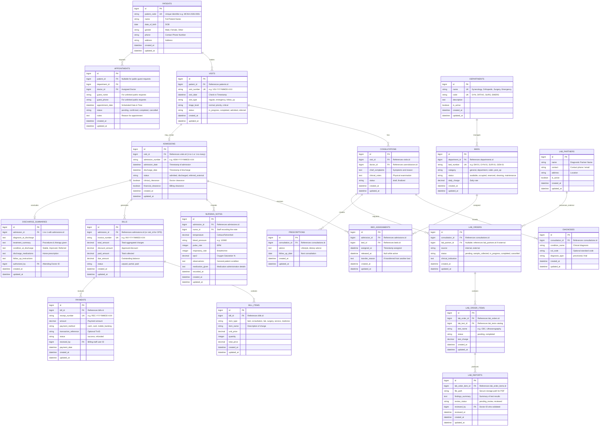

# 05. Approved Database Entity-Relationship (ER) Diagram
**Meghna Clinic and Nursing Home — Hospital Management System (HMS)**

---

## 1. Approved System ER Diagram

```mermaid
erDiagram
    PATIENTS ||--o{ VISITS : makes
    PATIENTS ||--o{ APPOINTMENTS : requests
    VISITS ||--o{ CONSULTATIONS : has
    VISITS ||--o| ADMISSIONS : may_create

    DEPARTMENTS ||--o{ BEDS : manages
    ADMISSIONS ||--o{ BED_ASSIGNMENTS : receives
    BEDS ||--o{ BED_ASSIGNMENTS : assigned

    CONSULTATIONS ||--o{ DIAGNOSES : records
    CONSULTATIONS ||--o{ PRESCRIPTIONS : creates
    ADMISSIONS ||--o{ NURSING_NOTES : includes

    CONSULTATIONS ||--o{ LAB_ORDERS : requests
    LAB_ORDERS ||--o{ LAB_ORDER_ITEMS : contains
    LAB_PARTNERS ||--o{ LAB_ORDERS : processes_external
    LAB_ORDER_ITEMS ||--o{ LAB_REPORTS : produces

    ADMISSIONS ||--o{ BILLS : generates
    BILLS ||--o{ BILL_ITEMS : contains
    BILLS ||--o{ PAYMENTS : receives

    ADMISSIONS ||--o| DISCHARGE_SUMMARIES : concludes

    PATIENTS {
        bigint id PK
        string patient_code UK "Unique Identifier e.g. MCNH-2026-0001"
        string name "Full Patient Name"
        date date_of_birth "DOB"
        string gender "Male, Female, Other"
        string phone "Contact Phone Number"
        string address "Address"
        datetime created_at
        datetime updated_at
    }

    APPOINTMENTS {
        bigint id PK
        bigint patient_id FK "Nullable for public guest requests"
        bigint department_id FK
        bigint doctor_id FK "Assigned Doctor"
        string guest_name "For unlinked public requests"
        string guest_phone "For unlinked public requests"
        datetime appointment_date "Scheduled Date & Time"
        string status "pending, confirmed, completed, cancelled"
        text notes "Reason for appointment"
        datetime created_at
        datetime updated_at
    }

    VISITS {
        bigint id PK
        bigint patient_id FK "References patients.id"
        string visit_number UK "e.g. VIS-YYYYMMDD-XXX"
        datetime visit_date "Check-in Timestamp"
        string visit_type "regular, emergency, follow_up"
        string triage_level "normal, priority, critical"
        string status "in_progress, completed, admitted, referred"
        datetime created_at
        datetime updated_at
    }

    DEPARTMENTS {
        bigint id PK
        string name UK "Gynecology, Orthopedic, Surgery, Emergency"
        string code UK "GYN, ORTHO, SURG, EMERG"
        text description
        boolean is_active
        datetime created_at
        datetime updated_at
    }

    BEDS {
        bigint id PK
        bigint department_id FK "References departments.id"
        string bed_number UK "e.g. EM-01, GYN-01, SUR-01, GEN-01"
        string category "general, department, cabin, post_op"
        string status "available, occupied, reserved, cleaning, maintenance"
        decimal daily_charge "Daily rate"
        datetime created_at
        datetime updated_at
    }

    ADMISSIONS {
        bigint id PK
        bigint visit_id FK "References visits.id (1-to-1 or 1-to-many)"
        string admission_number UK "e.g. ADM-YYYYMMDD-XXX"
        datetime admission_date "Timestamp of admission"
        datetime discharge_date "Timestamp of discharge"
        string status "admitted, discharged, referred_external"
        boolean clinical_clearance "Doctor clearance"
        boolean financial_clearance "Billing clearance"
        datetime created_at
        datetime updated_at
    }

    BED_ASSIGNMENTS {
        bigint id PK
        bigint admission_id FK "References admissions.id"
        bigint bed_id FK "References beds.id"
        datetime assigned_at "Timestamp assigned"
        datetime released_at "Null while active"
        text transfer_reason "If transferred from another bed"
        datetime created_at
        datetime updated_at
    }

    CONSULTATIONS {
        bigint id PK
        bigint visit_id FK "References visits.id"
        bigint doctor_id FK "References users/doctors.id"
        text chief_complaints "Symptoms and reason"
        text clinical_notes "Physical examination"
        string status "draft, finalized"
        datetime created_at
        datetime updated_at
    }

    DIAGNOSES {
        bigint id PK
        bigint consultation_id FK "References consultations.id"
        string condition_name "Clinical diagnosis"
        string icd_code "Optional standard code"
        string diagnosis_type "provisional, final"
        datetime created_at
        datetime updated_at
    }

    PRESCRIPTIONS {
        bigint id PK
        bigint consultation_id FK "References consultations.id"
        text advice "Lifestyle, dietary advice"
        date follow_up_date "Next consultation"
        datetime created_at
        datetime updated_at
    }

    NURSING_NOTES {
        bigint id PK
        bigint admission_id FK "References admissions.id"
        bigint nurse_id FK "Staff recording the note"
        decimal temperature "Celsius/Fahrenheit"
        string blood_pressure "e.g. 120/80"
        integer pulse_rate "BPM"
        integer respiratory_rate "Breaths/min"
        decimal spo2 "Oxygen Saturation %"
        text observations "General patient condition"
        text medication_given "Medication administration details"
        datetime recorded_at
        datetime created_at
        datetime updated_at
    }

    LAB_ORDERS {
        bigint id PK
        bigint consultation_id FK "References consultations.id"
        bigint lab_partner_id FK "Nullable; references lab_partners.id if external"
        string source "internal, external"
        string status "pending, sample_collected, in_progress, completed, cancelled"
        text clinical_indication
        datetime created_at
        datetime updated_at
    }

    LAB_PARTNERS {
        bigint id PK
        string name "Diagnostic Partner Name"
        string contact "Contact phone / email"
        string address "Location"
        boolean is_active
        datetime created_at
        datetime updated_at
    }

    LAB_ORDER_ITEMS {
        bigint id PK
        bigint lab_order_id FK "References lab_orders.id"
        bigint lab_test_id FK "References lab_tests catalog"
        string test_name "e.g. CBC, Ultrasonography"
        string status "pending, completed"
        decimal test_charge
        datetime created_at
        datetime updated_at
    }

    LAB_REPORTS {
        bigint id PK
        bigint lab_order_item_id FK "References lab_order_items.id"
        string file_path "Secure storage path for PDF"
        text findings_summary "Summary of test results"
        string review_status "pending_review, reviewed"
        bigint reviewed_by FK "Doctor ID who validated"
        datetime reviewed_at
        datetime created_at
        datetime updated_at
    }

    BILLS {
        bigint id PK
        bigint admission_id FK "References admissions.id (or visit_id for OPD)"
        string invoice_number UK "e.g. INV-YYYYMMDD-XXX"
        decimal total_amount "Total aggregated charges"
        decimal discount_amount "Approved discount"
        decimal paid_amount "Total collected"
        decimal due_amount "Outstanding balance"
        string status "unpaid, partial, paid"
        datetime created_at
        datetime updated_at
    }

    BILL_ITEMS {
        bigint id PK
        bigint bill_id FK "References bills.id"
        string item_type "bed, consultation, lab, surgery, service, medicine"
        string item_name "Description of charge"
        decimal unit_price
        integer quantity
        decimal total_price
        datetime created_at
        datetime updated_at
    }

    PAYMENTS {
        bigint id PK
        bigint bill_id FK "References bills.id"
        string receipt_number UK "e.g. REC-YYYYMMDD-XXX"
        decimal amount "Payment amount"
        string payment_method "cash, card, mobile_banking"
        string transaction_reference "Optional TrxID"
        string status "success, refunded"
        bigint received_by FK "Billing staff user ID"
        datetime payment_date
        datetime created_at
        datetime updated_at
    }

    DISCHARGE_SUMMARIES {
        bigint id PK
        bigint admission_id FK "1-to-1 with admissions.id"
        text diagnosis_at_discharge
        text treatment_summary "Procedures & therapy given"
        text condition_at_discharge "Stable, Improved, Referred"
        text discharge_medications "Home prescription"
        text follow_up_instructions
        bigint authorized_by FK "Attending Doctor ID"
        datetime created_at
        datetime updated_at
    }
```
